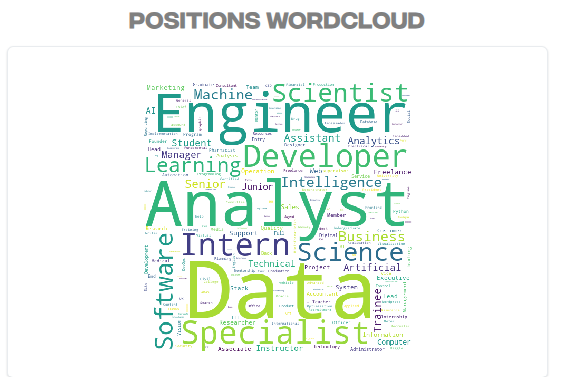

# LinkedIn Data Visualization Dashboard

Welcome to my LinkedIn Data Visualization Dashboard — a project crafted to bring personal professional data to life. This application dives deep into the patterns and narratives behind your LinkedIn connections, transforming exported CSV files into a fully interactive and visually rich dashboard.

---


## 🚀 Why This Project Exists

The inspiration for this dashboard came from a desire to better understand how my professional network has evolved over time — not just who I’m connected to, but where they work, what roles they hold, and how those patterns shift across the years. Rather than staring at rows in a CSV, I wanted something that visually told the story of my LinkedIn journey — patterns in hiring, clusters of industries, and surges in new connections.

This project turns passive data into active insight.

---

## 📊 From Data to Dashboard

At its core, this dashboard takes three exported datasets from LinkedIn: connections, invitations, and messages. Once loaded into the system, the backend logic prepares this data using structured transformation scripts, setting the stage for meaningful visualization.

The application is built with Dash by Plotly — ensuring a seamless experience in navigating between visual elements. Every section is modular, meaning each piece of data visualization can evolve independently.

The header greets you with a personalized view, and the layout allows for selecting the period of analysis. This interactivity adds flexibility to how insights are revealed, allowing you to compare different time windows or track changes over specific career periods.

---

## 🧠 Analytical Storytelling

The dashboard isn’t just about pretty charts — it’s about surfacing trends that aren’t obvious at a glance. 

Through visual storytelling, several perspectives emerge:
- A growth timeline showing how your network expanded over time.
- Common employers among your connections reveal where influence is strongest.
- Job titles highlight dominant themes and roles across your network.
- Word clouds and donut charts capture the diversity (or lack thereof) in your industry presence.

Each visualization is driven by tailored logic designed to filter noise and amplify signal.

---





---

## 🧱 Project Structure & Thought Process

This isn’t a monolithic app. It’s built with maintainability and scalability in mind:

- `app.py` boots the dashboard and connects the components.
- `graphics/` houses the plotting logic.
- `pages/dashboard/view/` orchestrates the different visual blocks — header, overview, and deep dives.
- `utils/data_preperation.py` takes care of data wrangling so the visualizations are clean and context-aware.
- `assets/` handles aesthetics: fonts, CSS, logos, and branding elements.
- `environment/` keeps settings and variables organized.

Screenshots are included to visually represent the dashboard's purpose and outcomes.


---


## Setup and Usage

To set up and run this project locally, you will need **Python** installed on your system.

1.  **Clone the repository:**
    ```bash
    git clone https://github.com/Mostafa-Elnagar/linkedin-dashboard.git
    ```

2.  **Navigate to the project directory:**
    ```bash
    cd linkedin-dashboard
    ```

3.  **Place your LinkedIn data:**
    * Export your personal LinkedIn data from your LinkedIn account settings.
    * Ensure your `Connections.csv`, `Invitations.csv`, and `messages.csv` files are placed in the `data/` directory within the cloned repository. This project relies on these files for generating the visualizations.

4.  **Install dependencies:**
    ```bash
    pip install -r requirements.txt
    ```

5.  **Run the application:**
    ```bash
    python app.py
    ```

6.  The dashboard will typically be accessible in your web browser at `http://127.0.0.1:8050/`.

Alternatively, you can use the provided `Dockerfile` to build and run the application in a Docker container for a more isolated environment:

```bash
docker build -t linkedin-dashboard .
docker run -p 8050:8050 linkedin-dashboard
```
---

## 🧭 Final Thoughts

This project isn’t just about data — it’s about insight. It’s about turning a static export from LinkedIn into something dynamic and personalized. Whether you’re tracking career growth, understanding industry trends in your network, or just exploring your connections from a new perspective — this dashboard puts you at the center of your own data story.

---


